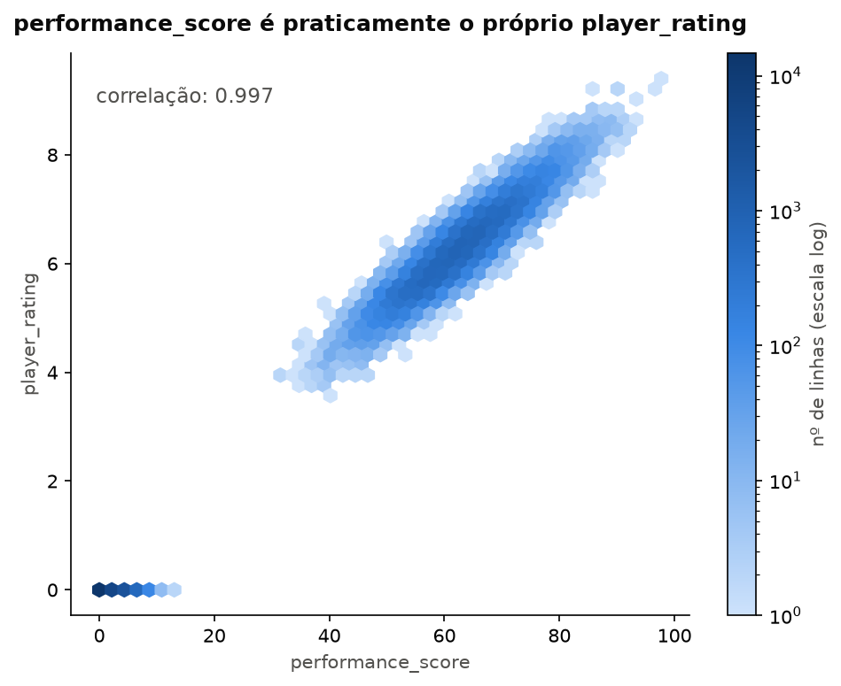
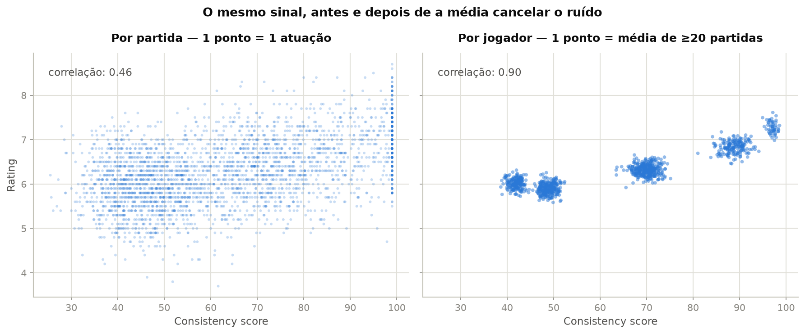
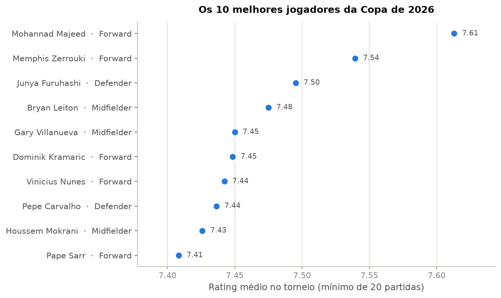
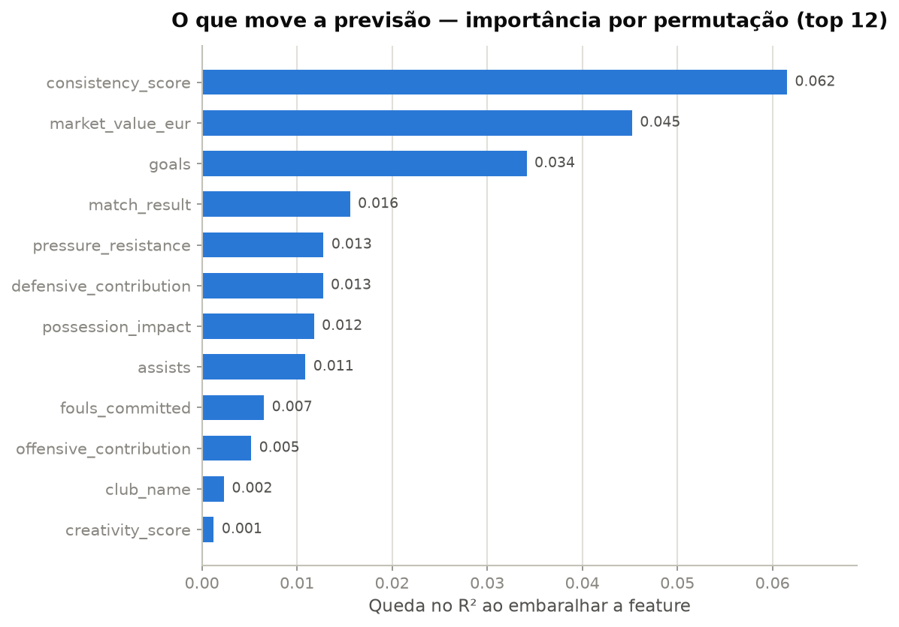

# Copa do Mundo 2026 — do EDA a um modelo honesto

Projeto de Data Science de ponta a ponta sobre um dataset **simulado** de performance de jogadores
na Copa do Mundo de 2026 (54.600 linhas — 1 linha = 1 jogador em 1 partida). O objetivo: sair da
análise exploratória e chegar a um modelo de Machine Learning que gere um **insight verdadeiro**
sobre os dados — o que, neste dataset, exigiu antes de tudo *não cair nas armadilhas dele*.

## A história em uma imagem

A primeira descoberta do projeto: `performance_score` tem correlação 0.997 com o alvo
(`player_rating`). Não é uma feature boa — é a fórmula do rótulo vazando para o modelo
(**data leakage**). Usá-la daria R² de 0.99 e um insight falso.



Removido o vazamento (e o restante do ruído mapeado no EDA), o modelo honesto — um Gradient
Boosting — explica **~29% do rating de uma partida** (MAE 0.49, 16% melhor que o baseline).
Parece pouco? É aí que entra o insight central do projeto:



**O rating de uma partida é dominado por ruído, mas o ruído se cancela na média.** A mesma feature
(`consistency_score`) que correlaciona 0.46 com a nota de uma partida correlaciona **0.90** com a
média do jogador — e a agregação ainda revela que o gerador sintético criou *camadas* discretas de
qualidade de jogador, invisíveis no nível da partida. A pergunta certa importa mais que o modelo.

## E o melhor jogador da Copa?



**Mohannad Majeed** (7.61 de rating médio em 23 partidas, mínimo de 20 jogos exigido). Detalhe:
o melhor jogador não é o mais caro — ele vale ~72M€, menos da metade de outros nomes do top 10.

## O que move a nota, segundo o modelo



Qualidade do jogador (`consistency_score`, `market_value_eur`) e impacto na partida (`goals`,
`match_result`, `assists`). Medindo diretamente: **cada gol vale ~+0.4 de rating** (quase linear)
e vencer vale ~+0.15 — enquanto **empatar vale o mesmo que perder**.

## Os notebooks

| Notebook | O que faz |
|---|---|
| [`01_eda`](notebooks/01_eda.ipynb) | Sanidade dos dados, definição do alvo (regressão em `player_rating`) e a investigação de data leakage — incluindo um falso positivo (`top_speed_kmh`) desmascarado |
| [`02_feature_engineering`](notebooks/02_feature_engineering.ipynb) | Seleção de features com justificativa por exclusão, redundâncias 1:1 (`nationality`↔`team`, `stadium`↔`city`), datas sem coerência temporal e a decisão de target encoding para `club_name` |
| [`03_modeling`](notebooks/03_modeling.ipynb) | Pipeline sem vazamento (split antes de tudo, encoding só no treino), baseline, Gradient Boosting, métricas (MAE/RMSE/R²), previsto vs. real, resíduos, importância por permutação e dependência parcial |
| [`04_insights`](notebooks/04_insights.ipynb) | Três perguntas respondidas com gráficos: o melhor jogador, onde a qualidade aparece e quanto valem gol e vitória |

Cada notebook é escrito como um relato: markdown explicando o porquê de cada decisão antes do
código, e a interpretação do resultado depois.

## Resultados do modelo

| | MAE | RMSE | R² |
|---|---|---|---|
| Baseline (prever a média) | 0.586 | 0.736 | 0.000 |
| Gradient Boosting — teste | 0.493 | 0.619 | 0.293 |
| Gradient Boosting — treino | 0.469 | 0.587 | 0.364 |

Treino e teste próximos = sem overfitting relevante. E o contraste que resume o projeto: com as
colunas vazadas o R² seria 0.99 — e seria mentira.

## Como rodar

```bash
python -m venv .venv
source .venv/bin/activate
pip install -r requirements.txt
jupyter lab
```

O CSV (`data/fifa_world_cup_2026_player_performance.csv`) não é versionado — coloque-o na pasta
`data/` antes de rodar os notebooks.

**Stack:** pandas · matplotlib · seaborn · scikit-learn
